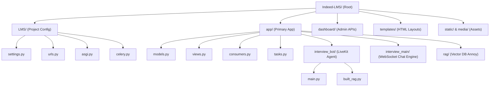
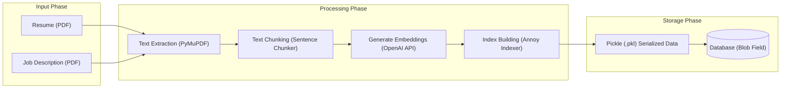

# Indeed-LMS — Complete Codebase Analysis and Setup Report

This report presents a thorough analysis of the **Indeed-LMS** codebase, its dependency graph, runtime configurations, startup errors, database architecture, and deployment pipeline, enriched with visual schematics to aid comprehension.

---

## 1. Executive Summary

**Indeed-LMS** is a Django-based Learning Management System designed to manage courses, categories, student progress, lessons, and completion certificates. In addition to standard LMS capabilities, the application features an **AI-powered Mock Interview Prep System**.

The mock interview engine consists of:
1. **Interactive WebSocket Chat**: Powered by Django Channels (`app/consumers.py`), allowing real-time voice chunk transmission, converting it to text via Google Speech-to-Text (`speech_recognition`), and evaluating answers using the OpenAI API.
2. **Real-time WebRTC Voice Agent**: Built using the `livekit-agents` framework (`app/interview_bot/main.py`), utilizing OpenAI's `gpt-4o-mini` for completions and Deepgram/OpenAI/Silero plugins for high-fidelity audio streams.
3. **Retrieval-Augmented Generation (RAG)**: Processes uploaded resumes and job descriptions (JDs), chunks and embeds them via OpenAI embeddings (`text-embedding-3-small`), and stores the resulting index as a serialized Annoy vector database (`.pkl`) in the MySQL database.

---

## 2. Repository Structure

Below is an overview of the directory hierarchy and key modules in the repository:



* [**`LMS/`**](file:///F:/prushual_technology/Indeed-LMS/LMS): Main project directory containing the root settings, ASGI/WSGI entrypoints, root URL mapping, and Celery setup.
  * [`settings.py`](file:///F:/prushual_technology/Indeed-LMS/LMS/settings.py): Application settings (CORS, middleware, database routing, Celery configuration, and logging handlers).
  * [`urls.py`](file:///F:/prushual_technology/Indeed-LMS/LMS/urls.py): Master URL configuration mapping core HTML views, admin pages, and routing to application APIs.
  * [`asgi.py`](file:///F:/prushual_technology/Indeed-LMS/LMS/asgi.py): ASGI entrypoint setting up Channels `ProtocolTypeRouter` for HTTP and WebSocket traffic.
  * [`celery.py`](file:///F:/prushual_technology/Indeed-LMS/LMS/celery.py): Celery application instantiation and task auto-discovery.
* [**`app/`**](file:///F:/prushual_technology/Indeed-LMS/app): Core application directory containing logic for authentication, course progress, assessments, certificates, and the AI interview bot.
  * [`models.py`](file:///F:/prushual_technology/Indeed-LMS/app/models.py): Contains all core schemas (User, ChatAccess, Course, VideoProgress, Assessment, Certificate, and RAG/session states).
  * [`views.py`](file:///F:/prushual_technology/Indeed-LMS/app/views.py): Contains views for page rendering, Stripe/Razorpay checkouts, and LiveKit token generation.
  * [`consumers.py`](file:///F:/prushual_technology/Indeed-LMS/app/consumers.py): Django Channels WebSocket consumer handling WebM audio uploads, converting them to WAV via subprocess ffmpeg, transcribing, and running the chat.
  * [`authentication.py`](file:///F:/prushual_technology/Indeed-LMS/app/authentication.py): Custom DRF `CookieJWTAuthentication` fallback.
  * [`tasks.py`](file:///F:/prushual_technology/Indeed-LMS/app/tasks.py): Asynchronous Celery tasks, specifically `build_user_rag`.
  * [**`interview_bot/`**](file:///F:/prushual_technology/Indeed-LMS/app/interview_bot): Real-time WebRTC LiveKit agent (`main.py` entrypoint) and the RAG generator script (`built_rag.py`).
  * [**`interview_main/`**](file:///F:/prushual_technology/Indeed-LMS/app/interview_main): The main interview processing library, handling dynamic evaluation, scoring, and text generation.
  * [**`rag/`**](file:///F:/prushual_technology/Indeed-LMS/app/rag): Contains vector indexing builders using `annoy`.
* [**`dashboard/`**](file:///F:/prushual_technology/Indeed-LMS/dashboard): Django application managing admin tools and dashboards.
  * [`views.py`](file:///F:/prushual_technology/Indeed-LMS/dashboard/views.py): REST API views for admin CRUD tables.
* [**`templates/`**](file:///F:/prushual_technology/Indeed-LMS/templates): Server-side HTML templates (e.g. [`interview_page.html`](file:///F:/prushual_technology/Indeed-LMS/templates/interview/interview_page.html), checkout pages).
* [**`static/`**](file:///F:/prushual_technology/Indeed-LMS/static) / [**`media/`**](file:///F:/prushual_technology/Indeed-LMS/media): Folder repositories for serving assets and caching user resumes/JDs.
* [**`user_interview_data/`**](file:///F:/prushual_technology/Indeed-LMS/user_interview_data): A cached folder to write output session transcripts (gitignored).

---

## 3. Django Architecture

* **Django version**: `5.2.13`
* **Project Root Routing**: [`LMS/urls.py`](file:///F:/prushual_technology/Indeed-LMS/LMS/urls.py) routes:
  * `/admin/` to default django admin.
  * `/dashboard/` to dashboard views.
  * `/api/` to REST API endpoints in [`app/urls.py`](file:///F:/prushual_technology/Indeed-LMS/app/urls.py).
  * Direct root patterns render server-side templates (HTML/JS) for login, registration, course directories, checking out, and the WebSocket mock interview interface.
* **ASGI Configuration**: `LMS/asgi.py` loads `ProtocolTypeRouter` which feeds WebSocket requests through `AuthMiddlewareStack` and routes to `ws/interview/` mapping to `InterviewConsumer`.
* **Middlewares**: Standard Django middleware along with `corsheaders.middleware.CorsMiddleware` to permit cross-origin requests.

---

## 4. Technology Stack

* **Language**: Python 3.11.9 (active virtual environment)
* **Framework**: Django 5.2.13
* **API Engine**: Django REST Framework 3.17.1 & SimpleJWT 5.5.1
* **WebSocket Server**: Django Channels 4.3.2 & Daphne 3.0.2
* **Database**: MySQL (configured in settings) & SQLite (local `db.sqlite3` file exists)
* **Queue / Task Broker**: Celery 5.6.3 running with Redis
* **Speech to Text / WebRTC**: LiveKit Agents (1.5.8), Deepgram SDK, SpeechRecognition (Google API)
* **Payment Service**: Razorpay SDK
* **Email System**: Msg91 API & Django SMTP

---

## 5. Dependency Analysis

### Comparison of Requirements Files

The table below lists the primary packages, their pinned versions, the version currently active in the virtual environment, whether they are imported by the Python application code, and the recommended version:

| Package | requirements.txt | requirements_rohit.txt | Installed in venv | Conflict in `requirements.txt`? | Used by Code? | Recommended Version |
| ------- | ---------------- | ---------------------- | --------- | --------- | ------------- | ------------------- |
| **protobuf** | `6.33.6` | `5.29.5` | `5.29.5` | Yes | No (Transitive dependency only) | `5.29.5` |
| **mediapipe** | `0.10.14` | *Not Pinned* | *Not Installed* | Yes | No | *Do Not Install* |
| **numpy** | `1.26.4` | `1.26.4` | `1.26.4` | No | Yes (in [`app/interview_bot/main.py`](file:///F:/prushual_technology/Indeed-LMS/app/interview_bot/main.py)) | `1.26.4` |
| **tensorflow** | `2.16.1` | *Not Pinned* | *Not Installed* | Yes | No | *Do Not Install* |
| **tensorflow-intel** | `2.16.1` | *Not Pinned* | *Not Installed* | Yes | No | *Do Not Install* |
| **keras** | `3.1.1` | *Not Pinned* | *Not Installed* | Yes | No | *Do Not Install* |
| **torch** | *Not Pinned* | `2.11.0` | `2.11.0` | No | No | `2.11.0` (Optional / Unused) |
| **transformers** | *Not Pinned* | `5.5.4` | `5.5.4` | No | No | `5.5.4` (Optional / Unused) |
| **langchain** | `0.1.0` | `0.1.0` | `0.1.0` | No | No | `0.1.0` (Optional / Unused) |
| **langchain-community** | `0.0.16` | `0.0.16` | `0.0.16` | No | No | `0.0.16` (Optional / Unused) |
| **langchain-core** | `0.1.23` | `0.1.23` | `0.1.23` | No | No | `0.1.23` (Optional / Unused) |
| **aiohttp** | `3.13.5` | `3.13.5` | `3.13.5` | No | Yes (in [`app/rag/rag_db_builder.py`](file:///F:/prushual_technology/Indeed-LMS/app/rag/rag_db_builder.py)) | `3.13.5` |
| **async-timeout** | `5.0.1` | `4.0.3` | `4.0.3` | Yes | No | `4.0.3` |
| **django** | `5.2.13` | `5.2.13` | `5.2.13` | No | Yes (in 32 files) | `5.2.13` |
| **djangorestframework** | `3.17.1` | `3.17.1` | `3.17.1` | No | Yes (in 6 files) | `3.17.1` |
| **channels** | `4.3.2` | `4.3.2` | `4.3.2` | No | Yes (in 3 files) | `4.3.2` |
| **celery** | `5.6.3` | `5.6.3` | `5.6.3` | No | Yes (in 4 files) | `5.6.3` |
| **redis** | `7.3.0` | `7.3.0` | `7.3.0` | No | Yes (via settings configuration) | `7.3.0` |
| **opencv-python** | `4.8.0.76` | `4.8.0.76` | `4.8.0.76` | No | No | `4.8.0.76` (Unused) |
| **opencv-contrib-python** | `4.9.0.80` | `4.9.0.80` | `4.9.0.80` | No | No | `4.9.0.80` (Unused) |
| **scipy** | `1.13.0` | `1.13.0` | `1.13.0` | No | No | `1.13.0` (Unused) |
| **pandas** | `2.3.3` | `2.3.3` | `2.3.3` | No | Yes (in 1 file) | `2.3.3` |
| **matplotlib** | `3.8.2` | `3.8.2` | `3.8.2` | No | No | `3.8.2` (Unused) |
| **pydantic** | `2.13.1` | `2.13.1` | `2.13.1` | No | No | `2.13.1` |
| **huggingface-hub** | `1.11.0` | `1.11.0` | `1.11.0` | No | No | `1.11.0` (Unused) |
| **sentence-transformers** | `5.4.1` | `5.4.1` | `5.4.1` | No | No | `5.4.1` (Unused) |

---

## 6. `requirements.txt` vs `requirements_rohit.txt`

1. **Who generated it**: `requirements_rohit.txt` was generated using a `pip freeze` command inside your local virtual environment after you resolved conflicts manually by trial and error.
2. **Current state**: It represents a flat dependency snapshot of your working virtual environment.
3. **Transitive dependencies**: Yes, it contains direct and indirect packages.
4. **Accidental / Incompatible packages**:
   * It contains packages that are unreferenced in the codebase (e.g., `torch`, `transformers`, `sentence-transformers`, `scipy`, `pandas`, `matplotlib`, `opencv-python`, `opencv-contrib-python`).
   * However, it contains **zero incompatible packages** for the active codebase because the heavy, conflicting packages (`mediapipe`, `tensorflow`, `keras`, `onnxruntime`, `opentelemetry`) have been excluded.
5. **Replacing `requirements.txt`**:
   * Yes, `requirements.txt` should be replaced or updated using the resolved dependency set since the original `requirements.txt` is fundamentally broken and cannot be resolved by pip due to conflicts between TensorFlow/Mediapipe and newer protobuf versions.

---

## 7. Python Version Analysis

* **Virtualenv Python**: `3.11.9`
* **System Python**: `3.10.1`
* **Compatibility**: Python 3.11.9 is fully compatible with the actively used packages: Django `5.2.13`, Django REST Framework `3.17.1`, Channels `4.3.2`, Celery `5.6.3`, Redis `7.3.0`, and the `livekit` libraries. 
* **Conclusion**: Keeping Python 3.11.9 is appropriate and correct. There is no code or package metadata that strictly requires a downgrade to Python 3.10.

---

## 8. Dependency Conflicts

The primary conflict in the original `requirements.txt` is:
* **Package A**: `mediapipe 0.10.14` requires `protobuf>=4.25.3,<5`.
* **Package B**: The user pinned `protobuf==6.33.6` (v6.x) and `tensorflow==2.16.1` (which requires older protobuf).
* **Current state**: `protobuf` is pinned to `6.33.6`. Since `6.33.6` is not `<5`, pip throws a resolution conflict and aborts installation.
* **Code Audit**: A search of the codebase shows that `mediapipe`, `tensorflow`, `keras`, `onnxruntime`, and `opentelemetry` are **never imported or used** anywhere in the active Python code.
* **Resolution**: The conflict is resolved by removing these unused packages from the requirements list. This allows `protobuf` to resolve to `5.29.5` (required by `livekit`), maintaining environment consistency.

---

## 9. Environment Variables

Below is the environment variable mapping extracted from the settings and code files:

| Variable | File | Purpose | Required for startup? | Local value possible? | Requires team credentials? |
| -------- | ---- | ------- | --------------------- | --------------------- | -------------------------- |
| `DJANGO_SECRET_KEY` | `LMS/settings.py` | Cryptographic secret key | **Yes** | Yes, any secure random string | No |
| `ENVIRONMENT` | `LMS/settings.py` | Configures `DEBUG` / hosts | **Yes** | Yes (`local` or `server`) | No |
| `AUTHENTICATION_CLASS` | `LMS/settings.py` | DRF authentication class | **Yes** | Yes (`app.authentication.CookieJWTAuthentication`) | No |
| `DB_NAME` | `LMS/settings.py` | MySQL database name | Yes (if using MySQL) | Yes, local database name | No |
| `DB_USER` | `LMS/settings.py` | MySQL database username | Yes (if using MySQL) | Yes, local username | No |
| `DB_PASSWORD` | `LMS/settings.py` | MySQL database password | Yes (if using MySQL) | Yes, local password | No |
| `DB_HOST` | `LMS/settings.py` | MySQL database host | Yes (if using MySQL) | Yes (`127.0.0.1`) | No |
| `DB_PORT` | `LMS/settings.py` | MySQL database port | Yes (if using MySQL) | Yes (`3306`) | No |
| `OPENAI_API_KEY` | `built_rag.py`, `main.py`, `config.py` | OpenAI API requests / Embeddings | **Yes** (crashes at import time if missing) | Yes, must start with **`sk-proj-`** | Yes (personal or team OpenAI key) |
| `LIVEKIT_URL` | `LMS/settings.py` | LiveKit server connection URL | No | Yes (e.g. `http://localhost:7880`) | No |
| `LIVEKIT_API_KEY` | `LMS/settings.py` | LiveKit authentication key | No | Yes, local dev key | No |
| `LIVEKIT_API_SECRET` | `LMS/settings.py` | LiveKit signature secret | No | Yes, local dev secret | No |
| `RAZORPAY_KEY_ID` | `LMS/settings.py` | Razorpay Key ID | No | Yes (Razorpay test key) | No |
| `RAZORPAY_KEY_SECRET` | `LMS/settings.py` | Razorpay API Secret | No | Yes (Razorpay test secret) | No |
| `CHAT_SOCKET_URL` | `LMS/settings.py` | WebSocket address for templates | No | Yes (`ws://127.0.0.1:8000/ws/interview/`) | No |
| `CELERY_BROKER_URL` | `LMS/settings.py` | Celery broker address | No | Yes (`redis://127.0.0.1:6379/0`) | No |

---

## 10. Authentication Architecture

Indeed-LMS uses a dual-path JWT cookie/header authentication mechanism:

```
Login Endpoint (/api/accounts/verify-otp)
    ↓
Generates access and refresh tokens via SimpleJWT
    ↓
Sets tokens as HttpOnly Cookie ("access_token") and responds to client
    ↓
Subsequent requests validated by app.authentication.CookieJWTAuthentication
    ↓
Checks 'Authorization' header first. If empty, falls back to COOKIES.get("access_token")
    ↓
Validates signature against settings.SIMPLE_JWT configuration
    ↓
Applies permission check IsAuthenticated (default)
```

Authentication configurations are located in `app/authentication.py`, `app/user_login.py`, and `LMS/settings.py`.

---

## 11. Database Architecture

* **Database Engine**: MySQL (`django.db.backends.mysql`).
* **SQLite Development Option**: An existing `db.sqlite3` file is located in the repository root. It was used in early development but currently has a mismatched migration history relative to the new consolidated migration file `app/migrations/0001_initial.py` (which was created after deleting `0002` through `0027` from disk).
* **Local Development Strategy**: SQLite can be used locally to avoid setting up a MySQL server. To do this, the local database file `db.sqlite3` must be backed up, and the database migrations must be re-applied to create a clean set of tables.

---

## 12. AI/ML Architecture

The AI/ML components are entirely API-driven. There are no local models loaded into GPU memory, making local development lightweight:



At runtime, the LiveKit WebRTC Voice Worker (`app/interview_bot/main.py`) or the Django Channels WebSocket Consumer (`app/consumers.py`) reads this index, performs cosine similarity searches (nearest neighbors) on user prompts, and sends retrieved context chunks to OpenAI's `gpt-4o-mini` chat completions API.

---

## 13. External Services

1. **OpenAI**: Core model driver. **Mandatory at startup** because the OpenAI client is initialized at the module level in task-related files.
2. **Redis**: Operates as the Channels channel layer backend and Celery message broker. Required for mock interview flows.
3. **LiveKit**: WebRTC server for real-time speech. Needed only if testing the voice agent WebRTC connection.
4. **Stripe / Razorpay**: E-commerce checkouts.
5. **SMTP Email**: Dispatching OTPs via Gmail backend.

---

## 14. API Architecture

Below is the directory of the application's REST APIs and real-time handlers:

```mermaid
sequenceDiagram
    autonumber
    actor Client as User / Client App
    participant Django as Django Backend (Views / API)
    participant Channels as Django Channels (WebSockets)
    participant LiveKit as LiveKit Server
    participant Worker as LiveKit Voice Agent (main.py)
    participant OpenAI as OpenAI API (GPT-4o-mini)

    Note over Client, OpenAI: Flow A: Django Channels WebSockets (Interactive Audio/Text Chat)
    Client->>Django: HTTP request to check chat access
    Django-->>Client: returns remaining seconds
    Client->>Channels: establishes connection at ws/interview/
    Note right of Channels: Loads RAG index from Database
    Channels-->>Client: sends first question
    loop Interactive Chat
        Client->>Channels: sends WebM audio chunks
        Note right of Channels: ffmpeg converts WebM to WAV; transcribes
        Channels->>OpenAI: sends user transcript + RAG context
        OpenAI-->>Channels: returns next question
        Channels-->>Client: sends next question (text)
    end

    Note over Client, OpenAI: Flow B: WebRTC LiveKit Audio Streaming (Bidirectional Voice)
    Client->>Django: POST /api/start-interview/ (resumes, difficulty)
    Note right of Django: Triggers RAG rebuild (Celery task)
    Django->>LiveKit: requests connection token
    LiveKit-->>Django: returns token & session data
    Django-->>Client: returns LiveKit connection details
    Client->>LiveKit: connects to WebRTC room using token
    LiveKit->>Worker: dispatches room event
    Worker->>LiveKit: joins room as audio agent
    Worker->>OpenAI: sends candidate audio stream (transcribed via Deepgram)
    OpenAI-->>Worker: streams agent response
    Worker->>LiveKit: streams agent voice (text-to-speech)
    LiveKit-->>Client: plays agent audio to candidate
```

| Method | URL | View | Authentication | Permission | Purpose |
| ------ | --- | ---- | -------------- | ---------- | ------- |
| **POST** | `/api/accounts/register` | `SendOTPAPIView` | None | AllowAny | Generates OTP code and registers user |
| **POST** | `/api/accounts/verify-otp` | `VerifyOTPAPIView` | None | AllowAny | Validates OTP and returns access/refresh token |
| **POST** | `/api/accounts/refresh-token` | `RefreshTokenAPI` | None | AllowAny | Refreshes simplejwt token |
| **POST** | `/api/accounts/logout` | `LogoutAPI` | SimpleJWT | IsAuthenticated | Blacklists SimpleJWT refresh token |
| **GET** | `/api/accounts/profile/<id>` | `api_get_profile` | SimpleJWT | IsAuthenticated | Returns user profile details |
| **PUT** | `/api/accounts/profile/<id>/update` | `api_update_profile` | SimpleJWT | IsAuthenticated | Updates user profile fields |
| **POST** | `/api/accounts/google-login` | `google_login` | None | AllowAny | Google OAuth token exchange |
| **GET** | `/api/courses/` | `PublishedCourses` | None | AllowAny | Returns list of published courses |
| **POST** | `/api/enroll/<id>/` | `EnrollCourseAPIView` | SimpleJWT | IsAuthenticated | Enrolls user in a specific course |
| **POST** | `/api/create-order/` | `CreateRazorpayOrderAPI` | SimpleJWT | IsAuthenticated | Generates Razorpay transaction order |
| **POST** | `/api/verify-order/` | `VerifyPaymentAPI` | SimpleJWT | IsAuthenticated | Verifies Razorpay payment signature |
| **POST** | `/api/start-interview/` | `StartInterviewAPIView` | CookieJWTAuth | IsAuthenticated | Triggers RAG compile; returns LiveKit token |
| **GET** | `/api/interview-history/` | `InterviewSessionHistory` | CookieJWTAuth | IsAuthenticated | Returns history of user's past interviews |
| **GET** | `/api/check-chat-access/` | `CheckChatAccess` | CookieJWTAuth | IsAuthenticated | Verifies remaining user session time credits |

---

## 15. Current Startup Errors

1. **`AttributeError: 'NoneType' object has no attribute 'rsplit'`**:
   * **Root Cause**: `LMS/settings.py` sets `REST_FRAMEWORK['DEFAULT_AUTHENTICATION_CLASSES']` to `AUTHENTICATION_CLASS` (read from environment). Since this variable is missing in `.env`, it resolves to `None`. When Django checks URLs at startup, DRF's settings loader tries to import the class by splitting the string path, which raises an AttributeError on `None`.
   * **Fix**: Define `AUTHENTICATION_CLASS=app.authentication.CookieJWTAuthentication` in `.env`.
2. **`openai.OpenAIError: The api_key client option must be set...`**:
   * **Root Cause**: `app/interview_bot/built_rag.py` and `app/interview_bot/main.py` instantiate `client = OpenAI(api_key=os.getenv("OPENAI_API_KEY"))` globally at the module level. These files are imported by `app/tasks.py` on startup. Because `OPENAI_API_KEY` is missing in `.env`, OpenAI's validation fails on load.
   * **Fix**: Provide `OPENAI_API_KEY` in `.env` (it must start with `sk-proj-`).

---

## 16. Missing Configuration

To run the backend locally, you must create a local [`.env`](file:///F:/prushual_technology/Indeed-LMS/.env) file in the root containing:

```env
DJANGO_SECRET_KEY=!4^mp@hu^_iwspm&04l40^%$xr%8f74x=fe7x5j!k+7(^+r4*l
ENVIRONMENT=local
AUTHENTICATION_CLASS=app.authentication.CookieJWTAuthentication
OPENAI_API_KEY=sk-proj-YOUR_OPENAI_PROJECT_KEY_HERE
CHAT_SOCKET_URL=ws://127.0.0.1:8000/ws/interview/
```

*If you do not run local MySQL, you must also modify settings.py to point to SQLite for local development.*

---

## 17. Correct Local Development Setup

To run Indeed-LMS locally, follow this sequence:

```
Configure .env file with mandatory variables
    ↓
Point settings.py to SQLite if no local MySQL is installed
    ↓
Start Redis local server instance (port 6379)
    ↓
Regenerate/Apply Django database migrations
    ↓
Verify configurations with 'python manage.py check'
    ↓
Start Django development server (runserver)
```

---

## 18. Recommended Dependency Strategy

### Question 1: Should I use requirements.txt or requirements_rohit.txt for local development?
Use a cleaned-up version of **`requirements_rohit.txt`**. The original `requirements.txt` is broken and cannot be resolved due to conflict pins on unused libraries.

### Question 2: Is Python `3.11.9` appropriate?
Yes. All active frameworks (Django 5.x, DRF, Channels, Celery, and LiveKit) run stably on Python 3.11.9.

### Question 3: What is the correct version of protobuf for the actual application?
The correct version is **`5.29.5`** (active in the venv). It is compatible with all installed packages.

### Question 4: Is mediapipe==0.10.14 actually used by the application?
No. MediaPipe is never imported in the codebase.

### Question 5: If MediaPipe is used, what protobuf version should be installed?
If it were used, it would require `protobuf>=4.25.3,<5`. You would have to install a version like `4.25.3` to avoid metadata conflicts.

### Question 6: If another package requires protobuf 5/6, how should the conflict be resolved?
If another package strictly needed protobuf v5+, you would have to run them in separate environments, run MediaPipe in a separate microservice, or upgrade MediaPipe to a version that supports protobuf v5+.

### Question 7: Should a package be upgraded/downgraded, or should a dependency pin simply be corrected?
The dependency pin should be corrected by removing the unused conflicting packages (`mediapipe`, `tensorflow`, `keras`, `onnxruntime`, `opentelemetry`) from the requirements file.

### Question 8: Can the project run without MediaPipe/TensorFlow/etc. during basic Django startup?
Yes. The project starts up and runs without them.

---

## 19. Security Issues

* **Hardcoded MSG91 auth key**: Hardcoded in [`app/send_otp.py:L30`](file:///F:/prushual_technology/Indeed-LMS/app/send_otp.py#L30) (`"authkey": "392023Ah8auuoo640826d6P1"`).
* **Hardcoded SMTP credentials**: Gmail password is hardcoded in [`settings.py:L228`](file:///F:/prushual_technology/Indeed-LMS/LMS/settings.py#L228).
* **CORS Allow All**: `CORS_ALLOW_ALL_ORIGINS = True` is active, which should be restricted in production.

---

## 20. Technical Debt

* **Module-Level OpenAI Instantiations**: Global client instantiation in `built_rag.py` and `main.py` causes crashes at Django startup if the OpenAI key is missing.
* **Deleted Migration History**: Deleting migrations `0002` through `0027` from disk causes split history issues in databases containing older tables.
* **No Database Local Toggle**: Settings do not automatically switch database engines based on `ENVIRONMENT`.

---

## 21. Exact Next Steps

### Action 1 (Proposed Code Change - Settings)
To prevent developers from having to run a MySQL instance locally, we propose adding a conditional database toggle to the bottom of [**`LMS/settings.py`**](file:///F:/prushual_technology/Indeed-LMS/LMS/settings.py):

```python
if os.getenv('ENVIRONMENT') == 'local':
    DATABASES = {
        'default': {
            'ENGINE': 'django.db.backends.sqlite3',
            'NAME': BASE_DIR / 'db.sqlite3',
        }
    }
```
*Please approve this change before proceeding.*

### Action 2 (Proposed Code Change - OpenAI Lazy Loading)
To prevent Django commands from crashing when `OPENAI_API_KEY` is missing during automated test suites or local migrations, we propose wrapping the global client variables in a function or configuring them to load lazily:

In [`app/interview_bot/built_rag.py`](file:///F:/prushual_technology/Indeed-LMS/app/interview_bot/built_rag.py):

```diff
-client = OpenAI(api_key=os.getenv("OPENAI_API_KEY"))
+def get_openai_client():
+    return OpenAI(api_key=os.getenv("OPENAI_API_KEY"))
```
And replace the references inside the functions.
*Please approve this change before proceeding.*
